# 🚀 Workflow Quick Guide

This is a practical guide for using the workflow system between human and AI.

## 📖 TL;DR (To Get Started Quickly)

1. **📝 Create Story**: Copy `.cursor/stories/_template.md` → fill → save as `YYYY-MM-DD-your-task.md`
2. **🤖 Execute**: Ask AI to execute the story
3. **📊 Review**: Check the automatically generated changelog

## 🔄 Complete Flow

```mermaid
graph TD
    A[📝 Write Story] --> B[🤖 AI Executes Task]
    B --> C[📊 AI Generates Changelog]
    C --> D[✅ Review & Validation]
    D --> E{Satisfactory?}
    E -->|Yes| F[🎉 Completed]
    E -->|No| G[📝 Adjust Story]
    G --> B
```



## 🏗️ System Structure

```
.cursor/
├── CURSOR.MD                    # 📋 General project context
├── WORKFLOW-GUIDE.md           # 🚀 This quick guide
├── stories/                    # 📝 Task documentation
│   ├── README.md               # 📖 How to create stories
│   ├── _template.md            # 📄 Base template
│   └── 2024-01-20-example-*.md # 💡 Practical example
└── changelog/                  # 📊 Implementation records
    ├── README.md               # 📖 How to read changelogs
    └── _template.md            # 📄 Base template
```

## 🎯 Practical Use Cases

### 🆕 New Feature

```bash
# 1. Create story
cp .cursor/stories/_template.md .cursor/stories/2024-01-20-new-feature.md
# 2. Fill details
# 3. Request execution: "Execute story 2024-01-20-new-feature"
```

### 🐛 Bug Fix

```bash
# 1. Create story with bug context
# 2. Include logs/reproduction
# 3. Specify expected solution
```

### 🔧 Refactoring

```bash
# 1. Document current code
# 2. Specify desired structure
# 3. Define non-regression criteria
```

## 💡 Golden Tips

### ✅ For Effective Stories

- **Be specific**: "Implement JWT authentication" > "Make login"
- **Include examples**: Code, interfaces, behaviors
- **Define boundaries**: What is/isn't in scope
- **Think about edge cases**: Errors, validations, limits

### ✅ For Better Results

- **Context is king**: Explain the "why" beyond the "what"
- **Clear criteria**: How to validate if it's correct?
- **Useful references**: Links, examples, existing patterns

### ❌ Avoid

- Vague or ambiguous stories
- Mixing multiple features in one story
- Forgetting to define acceptance criteria
- Not specifying technologies/patterns

## 🔍 Quick Templates

### Simple Story

```markdown
# [STORY] Clear Title

## Context

What needs to be done and why?

## Objectives

- [ ] Specific objective 1
- [ ] Specific objective 2

## Acceptance Criteria

- [ ] How to validate it's correct
```

### AI Command

```
"Execute story '.cursor/stories/2024-01-20-my-task.md'"
```

## 📊 Monitoring and Analysis

### Check Implementations

```bash
# See latest implementations
ls -la .cursor/changelog/ | head -10

# Search by feature
grep -r "useCounter" .cursor/changelog/

# See story status
grep -r "Status:" .cursor/stories/
```

### Useful Metrics

- **Average implementation time**
- **Success rate (without rework)**
- **Complexity (files changed)**
- **Quality score (tests, documentation)**

## 🆘 Troubleshooting

### 🚨 Story wasn't executed correctly

1. Check if criteria are clear
2. Add more context/examples
3. Break into smaller stories

### 🚨 Incomplete changelog

1. Check if all requirements were specified
2. Review implemented code
3. Request additional details

### 🚨 Code doesn't work

1. Consult changelog to understand decisions
2. Check if all dependencies were installed
3. Run tests mentioned in changelog

## 🔗 Useful Links

- **General Context**: `.cursor/CURSOR.MD`
- **How to Create Stories**: `.cursor/stories/README.md`
- **How to Read Changelogs**: `.cursor/changelog/README.md`
- **Practical Example**: `.cursor/stories/2024-01-20-example-implement-hook-useCounter.md`

---

**🎯 Remember**: Workflow success depends on communication quality. The clearer and more specific you are in the story, the better the implementation will be!

**🚀 Next Step**: Create your first story using the template and test the system!
